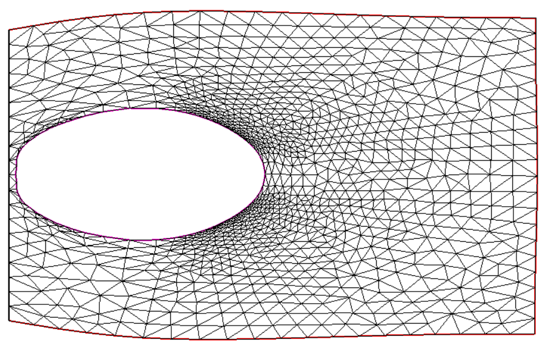
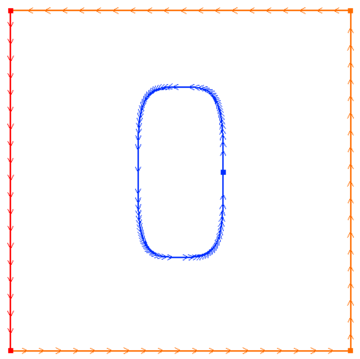
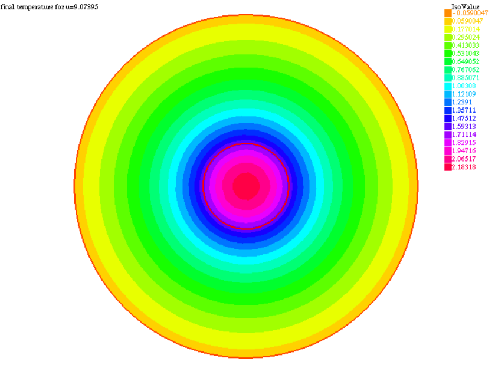
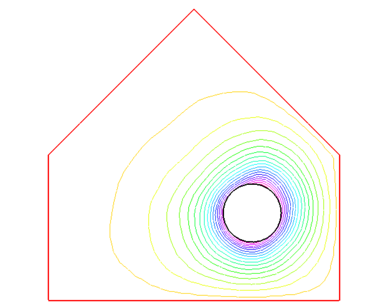

# MAP562-Structual-optimization
structure optimization course materials, including homework, lecture note, etc.

This course introduces techniques like shape optimization, parameter optimization and finally topological optimization.
The main formulation of the problem is based on variational methods, finit elements based.

The code is mainly composed by [FreeFem++](https://freefem.org/), a A high level multiphysics finite element software developped by French team inlcuding INRIA, Polytechnique..

We have studied cases like minimizing mechanical compliance. As well as some heat diffusion optimization like "disque" and "house" shape heat:

    
    

    
    

    

